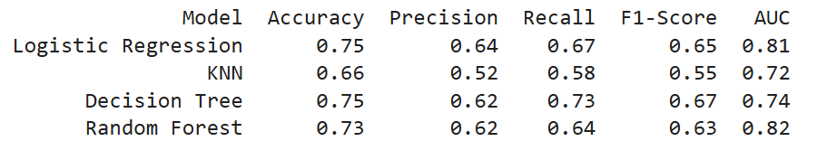
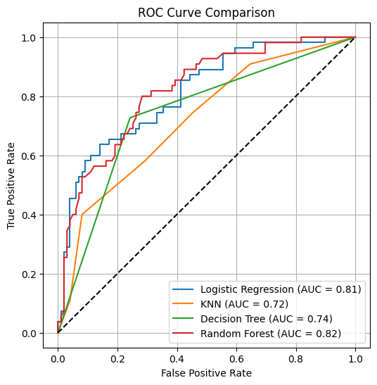

# 🩺 Diabetes Detection System

A machine learning-based classification system that predicts whether a person has diabetes using diagnostic data. This project explores multiple ML algorithms and evaluates their performance using key classification metrics and ROC curves.

---

## 📊 Features in the Dataset

- Pregnancies  
- Glucose  
- BloodPressure  
- SkinThickness  
- Insulin  
- BMI (Body Mass Index)  
- DiabetesPedigreeFunction  
- Age  
- Outcome – Target variable (0 = No Diabetes, 1 = Has Diabetes)

---

## 🧠 Models Used

- Logistic Regression  
- K-Nearest Neighbors (KNN)  
- Decision Tree  
- Random Forest  

---

## ⚙️ Project Workflow
1. Load the Dataset   
Data is loaded using pandas from a CSV file (diabetes.csv) containing 768 records with 8 features and 1 target.

3. Data Preprocessing  
Checked for null values.  
Standardized features using StandardScaler.  

3. Train-Test Split  
Dataset is split into 80% training and 20% testing using train_test_split.  

4. Model Training & Evaluation  

  Each model is trained and evaluated using:  
- Confusion Matrix  
- Classification Report  
- ROC-AUC Score  

5. ROC Curve Plotting  
All models' ROC curves are plotted on a single graph for comparison.

7. Model Performance Summary
  

---

## 📈 Visualizations

ROC curves comparing classifier performance  

---

## 🚀 Work on It

Clone the repo:  

git clone [https://github.com/imran-sony/classification-diabetes_detection.git](https://github.com/imran-sony/classification-diabetes_detection.git)  
cd classification-diabetes_detection

Run the notebook or script to train and evaluate models.
